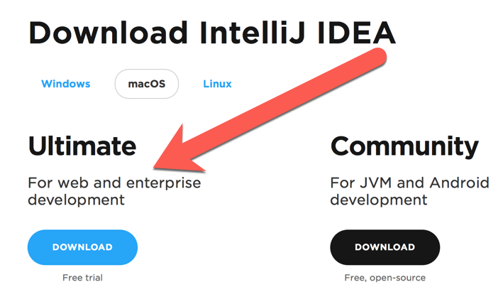

# Install IntelliJ IDEA Development Environment

IntelliJ IDEA (also known simply as IDEA) is an "integrated development environment", aka an IDE, specifically for Java development.
It has many powerful features making it easy and fun to work with Java code, such as automated refactoring tools, unit test runners, and much, much more.

> **Note:** If you haven't already installed the Java 8 JDK and Maven, you should do that first.

> Remember: install the **Ultimate** edition.

To download IntelliJ IDEA (the latest release is 2018.1.6), visit [this link](https://www.jetbrains.com/idea/download/) and **choose the "Ultimate" edition** (which has a 30-day free trial).

## Evaluate for Free

When starting IntelliJ IDEA for the first time, select the "Evaluate for free" option and then select `Evaluate`, and then `Accept` the license agreement.

## Skip Customize

The next screen will be **Customize IntelliJ IDEA**, but for now select `Skip All and Set Defaults`.

## Welcome

Once the "Welcome" screen appears, then you're done!
