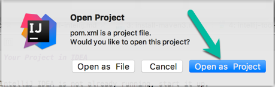
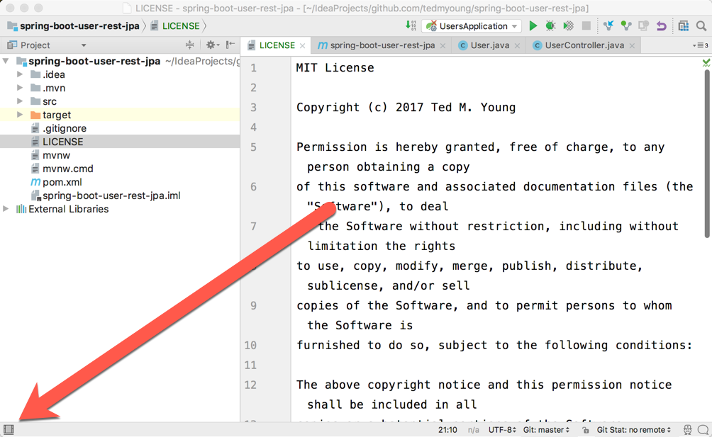
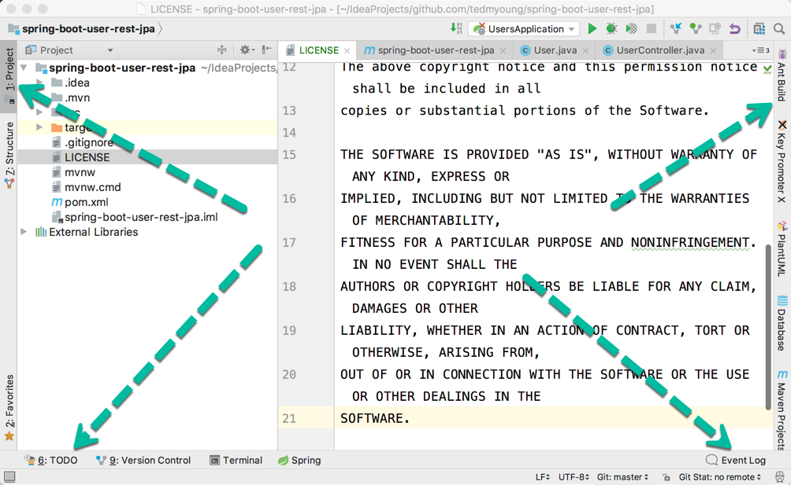
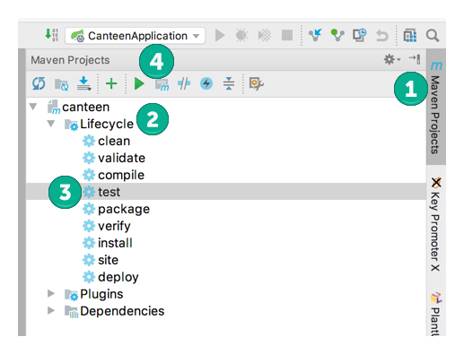
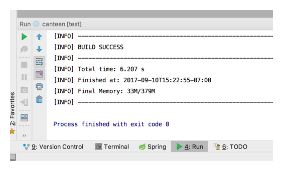

# Open Your Project in IDEA

1. If IntelliJ IDEA is not already running, start it up.

2. From the "welcome" screen, choose the `Open` item.

3. Navigate to the root of your project and select the `pom.xml` file, then click `Open`.

4. IDEA will then ask you how to open this file. Since we want it to be a new **project**, click `Open as Project`.

    

5. Turn on the tool window buttons by clicking on the icon in the lower-left:

    

6. You should now see buttons along the left, bottom, and right edges:

    

7. Find the `Maven Projects` tab, which should be on the right-side edge of the window, 
   and click on it (1) to open up the tool window.

    

8. Open the `canteen` project tree, then open the `lifecycle` tree (2).

9. Click on the `test` item (3) and then click the green arrow (4) to execute the test task.

10. If all goes well, you'll see the test run and pass in a console as shown below:

     
