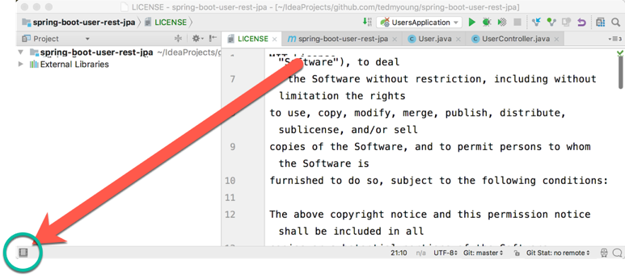
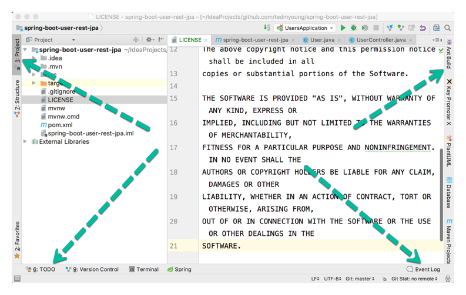

# Open Your Project in IDEA

1. If IntelliJ IDEA is not already running, start it up.
2. From the "welcome" screen, choose the `Open` item.
3. Navigate to the root of your project and select the `pom.xml` file, then click `Open`.
4. IDEA will then ask you how to open this file. Since we want it to be a new **project**, click `Open as Project`.
5. Turn on the tool window buttons by clicking on the icon in the lower-left:
    
6. You should now see buttons along the left, bottom, and right edges:
    
